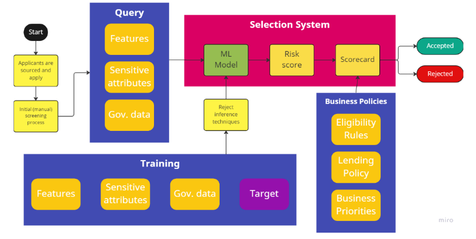
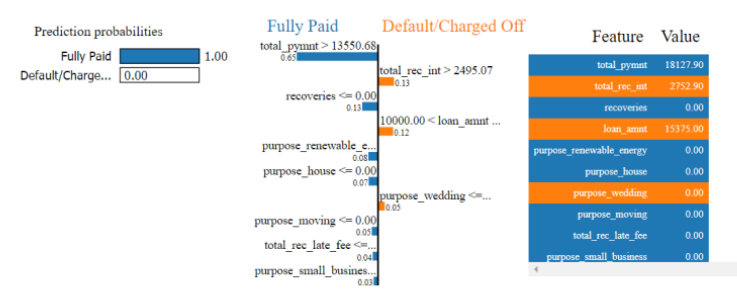
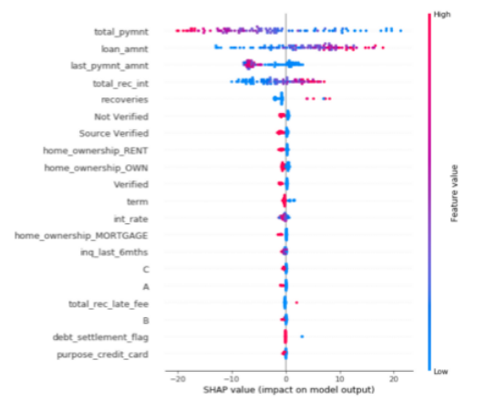

# Credit Scoring
{: .no_toc }

## Table of contents
{: .no_toc .text-delta }

1. TOC
{:toc}

## Input 
While credit scores are primarily used to determine an individual’s likelihood to repay a loan, they can also be used to determine access to housing, fraud likelihood, and social standing. For “unbanked” or “underbanked” individuals, credit scores may be harder to determine since traditional data sources such as loan repayment history is unlikely to be available. Thus, they become one of the most at-risk groups for unfair credit scoring. Examples of such customers may be based on “Gender” and “Marital Status” attributes; women and/or unmarried individuals may be at risk for system disadvantage. A low score can eliminate access to other opportunities such as real estate, utilities, products, and automobiles and can take years to turn around, so such decisions with at-risk groups should not be taken lightly. Thus, when creating or maintaining a credit scoring system, we suggest reflecting on the following questions: 
- What else is this credit score being used for? Is this score or insights derived from this score being shared with external parties? 
- What are the customers’ views about the benefits or risks of the credit scoring system? 
- What impacts could the system’s result have on an individual, financially, reputationally, socially, or emotionally? How could potentially negative impacts be mitigated? 

Credit scoring systems are usually not used alone; automated decision tools with large impacts are usually embedded within a process that contains other business rules and interventions from human actors. It would be ideal for the DSAI System Owners, Developers, and Assessors to have a clear idea of the entire credit approval process and understand the potential impacts the DSAI system may have on each component, step, and actor. A high-level example of such a process is shown below: 

If a credit scoring model is built on samples of individuals that are not representative of individuals applying for credit, there will be sample bias. Data skews towards previously accepted applicants because institutions are unable to observe cases of previously rejected applicants. Models are usually trained on skewed samples, containing only previously accepted applicants. 
- **Applicant attributes from application** – gender, marital status, age, education, income, income type, occupation, industry, loan type, household type, fraud indicators, location 
- **Past information** may include – previous credit scores, monthly balances of credits, all previous applications for bank loans, repayment history, behavioral data 

Reject inference techniques can be designed to minimize effects of sample bias by taking into account the data in rejected applications. However, imputations resulting from these techniques just adds uncertainty. We posit some reflective questions that may aid DSAI System Owners and Developers in addressing these concerns: 
- If data from previously rejected applicants are not used to train the model, how might the sample bias affect model performance? 
- If a reject inference technique has been used, what uncertainty does it introduce? Can this uncertainty be quantified? 
- If reject inference techniques have not been used, how are the issues being addressed? Why is this approach superior as compared to using such techniques? 

The class of charged off loans will normally have a smaller representation within the dataset as compared to fully paid loans. To test for this imbalance, we can use methods such as difference in positive proportions in labels (DPL), KL divergence (KL), and others mentioned previously. Other preprocessing techniques may include binning of categorical attributes, feature scaling, converting categorical variables to numerical representations, and flipping ground truth values. 

## M&O 
Locally Interpretable Model Agnostic Explanations (LIME) is a post-hoc model-agnostic explanation technique which aims to approximate any black box machine learning model with a local, interpretable model to explain each individual prediction. By model agnostic explanations, the authors suggest that it can be used for explaining any classifier, irrespective of the algorithm used for predictions as LIME is independent of the original classifier. For obtaining instance explanations using the LIME framework, the lime explainers available in the Python library "LIME" were used. The specific steps involved in getting the model explanations are: 
1. Create a list of all the features names.  
2. Create a list of Target label categories, i.e. "Fully Paid" and "Default".  
3. Create a function that takes in an array of feature values and returns class probabilities.  
4. In the lime tabular explainer object, pass the training data, features list, class list and the probability returning function mentioned above.  
5. After creating the explainer, select an instance to be explained and pass it as an argument to the explainer. The output is then a list of top 10 features affecting the model’s prediction for that instance. 

The visualization of the main features that have contributed towards pushing the probabilities towards either class are represented in the figure below: 

Here, we present an example of a loan model predicting a class "0" output (i.e. loan contract will not default). It also shows the top ten features that contributed to this decision along with respective confidence in its prediction. We can interpret this as follows:  
- Since the value of the "total_payment" variable was $18,127.90, which is greater than $13,550.68 (a value used by the model for making a decision), this drives the prediction towards the "Fully Paid" category.  
- Similarly, since there were no recoveries made on the loan, the model drives the prediction towards the "Fully Paid" category  
- The "loan_amnt" > $10,000 pushes the prediction towards "Default". However, the weight for this feature is not very high. Similarly, "total_rec_int" is high, the model pushes the prediction towards "Default". 
- Overall, the model predicts with absolute certainty that given the feature values for this particular customer, the loan contract will not default. Furthermore, the model developers can also provide the reasoning behind the decision taken to the end users. 

SHAP, short for Shapley Additive Explanations, presents a unified framework for interpreting predictions. SHAP assigns each feature an importance value for a particular prediction. 

These interpretations can be made from the figure above:  
- "total_pymnt", "loan_amnt", "last_pymnt_amnt", "total_rec_int" and "recoveries" are the top five important features.  
- The SHAP values suggest that a higher "total_pymnt" (represented by red colored dots in the figure) are associated with a lower probability of default whereas a lower value of "total_pymnt" (blue colored dots) are associated with a higher probability of default. The association with the target variable is inferred from the x-axis with positive values implying the "Default" category and negative values implying the "Fully Paid" category.  
- In the context of home ownership, the SHAP values suggest that owning a house does not have a significant impact on the model’s output. 

In addition to these usual performance metrics, we may choose certain criteria to further assess the soundness of XRAI principles in the DSAI system. Such measures include: 
- Demographic parity – equal approval/rejection rates between groups 
    - Pro: Captures benefits of gaining access to credit 
    - Con: Does not account for differences in base default rates between groups
    - Con: Lumps TPs and FPs together, ignoring harms of defaulting 
- Equal opportunity – equal TPRs/FNRs between groups 
    - Pro: Ensures equal fractions of applicants who repay loans will actually receive loans and benefit 
    - Con: Dependent on the reject inferences 
    - Con: Does not capture all harms and benefits (from FPs and TNs) 
- FPR balance – equal FPRs/TNRs between groups 
    - Pro: Ensures equal fractions of applicants who would default their loans will actually be denied loans, thus avoiding harm 
    - Con: Dependent on the reject inferences 
    - Con: Does not capture all harms and benefits (from TPs and FNs) 
- Equalized or averaged odds – equal TPRs & FPRs / FNRs & TNRs between groups 
    - Pro: Combination of the two previous criteria 
    - Con: Strict, allowing less utility 
- Positive predictive parity – equal precision between groups 
    - Pro: Does not rely on reject inference 
    - Con: Only compares fraction of TPs to Ps in each group, not insightful 

Aside from the volume, it is important to measure the magnitude of unfairness being made. For example, groups a and b may have identical FNRs (incorrect declines), but most errors for group a can be for high-value loans and most errors for group b can be for low-value loans. 

## D&M 
When using models that predict creditworthiness in customers, models may suffer from data drift. OOT testing can be used to inspect this data drift phenomenon and indicators like PSI can be used to calculate the magnitude of the drift to determine if the model requires any retraining. 

Another potential point of analysis is going through overrides – when a model output has been ignored or amended. Overrides or exceptions can create fair lending risks by causing similarly qualified applicants to be treated differently.  Overrides can have higher predictive power than AI model prediction when there are data limitations, or other complex financial situations that are difficult for the AI model to assess. Thus, analysis must be made between model output and overrides during credit scoring, and there should be clear guidelines to ensure fairness and consistency regarding valid reasons for overrides, such as: 
- Documentation for granting an override 
- Monitoring of frequency of override should remain in an acceptable range 
- Override corresponds to logit/likelihood calculated by DSAI system 
- Employees associated with the override decision are monitored 