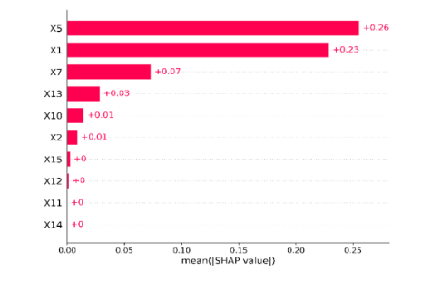
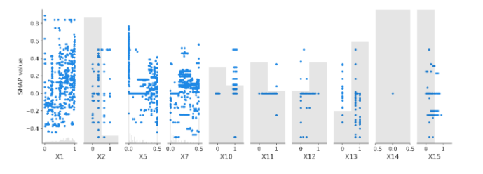
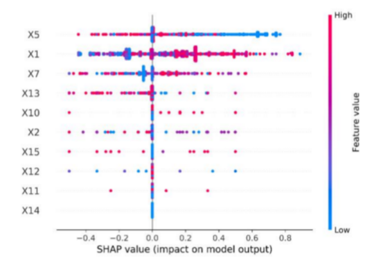

# Fraudulent Transaction
{: .no_toc }

## Table of contents
{: .no_toc .text-delta }

1. TOC
{:toc}

Banks have previously used brute-force rules to block suspected fraudulent transactions. However, hard-coded rules, for example, flagging all transactions above a certain threshold, may result in blocking many good transactions. ML models can make better distinctions or patterns for fraud detection. However, in preventing fraud, banks increase the risk of blocking good customers, which negatively affects low-income individuals (Weber et al., 2019).​​ On the other hand, reducing false positives (i.e. flagging a legitimate customer) will increase truly fraudulent transactions to escape detection.  

## Input 
Since there are many features available for training, a good ML model adhering to XRAI objectives will consider appropriate and balanced features that will not put disadvantaged groups such as one-income households at risk. Furthermore, since the model predicts a probability (or precision-recall score), an imbalanced class will exacerbate bias during training.  

The class of fraudulent transactions will normally have a smaller representation within the dataset as compared to non-fraud data points. To test for this imbalance, we can use methods such as difference in positive proportions in labels (DPL), KL divergence (KL), Jenson-Shannon divergence (JS), Lp-Norm (LP), Total variation distance (TVD), Kolmogorov-Smirnov (KS), Conditional Demographic Disparity in Labels (CDDL). 

## M&O 
When an ML classifier for fraud assigns a probability or score that the transaction is fraudulent, we need to determine how effective the model is at detecting fraud. There are various ways of observing the XRAI principles within this model. Among them, the most popular ones are local explanations and global explanations. Among them, SHAP (Shapley Additive Explanations) is one of the most popular methods. Essentially, these Shapley values are the average expected marginal contribution by considering all combinations. This is performed as a post-hoc analysis. An example of SHAP being applied to a model that has been used to predict fraudulent transactions from a collection of ATM transactional data, is demonstrated in the figures below: 

 

Feature importance score represents how “important” is a feature in predicting the target variable. The feature importance is depicted in the first pic, which is based on the mean SHAP values. This shows that X5 is the most important feature, followed by X1 and X7. Feature X14, X11, X12 and X15 achieved little to no feature importance. Further, the complete range of all the features is depicted in the second figure. This further supports the fact that X14 has no impact in predicting whether an ATM transaction is fraudulent/ nonfraudulent. All other features have lower feature importance scores which show that it is restricted to only a few numbers of samples. Although feature X1 has a wider range of impact compared to feature X5, the latter’s values are more densely grouped compared to X1. This indicates that feature X5 is more effective in predicting the outcomes than X1. Thus, X5 is the most important feature.  

In the figure above, we can see the density scatter plot of SHAP values obtained by various features. These plots help to identify the impact of each feature on the models’ predictions. This figure shows that feature X5 has a higher impact than other features. However, the less dense region indicates that the impact on the predictions decreases for a higher number of samples. Further, feature X1 has a larger impact on the prediction based on fewer samples. On the other hand, feature X7 has a smaller impact on the prediction.  

## D&M 
Even before deployment, we should verify that the model performs well and is robust. To do so, we measure the change each model would cause to several metrics, such as false positive rate, block rate (i.e., number of accounts flagged as fraudulent), and authorization rate (i.e., number of accounts cleared as authentic) on an aggregated or subset of account holders. If we find during deployment and monitoring, that the model would cause an undesirable shift in one of the performance metrics, we can adjust for different subsets of account holders to minimize disruptions and ensure optimal performance. 

When using models that predict fraudulent transactions using banking data, models may suffer from data drift. OOT testing can be utilized to catch this data drift phenomenon, and indicators like PSI can be used to calculate the magnitude of the drift to determine if the model requires any retraining. 