# XRAI Methodology - Model & Output (M&O) - Model Performance
{: .no_toc }

## Table of contents
{: .no_toc .text-delta }

1. TOC
{:toc}

Performance metrics in Machine Learning is the key to assess how your model is performing for a certain condition with a focus on effectiveness and reliability of the model. This is an important step in a Machine Learning development pipeline before you can decide that you have reached the expected or optimized model performance.  

## Regression Metrics 
Regression metrics are used to evaluate the performance of algorithms that predict continuous numerical values.  

### Mean Absolute Error (MAE) 
Mean Absolute Error (MAE) is a popular metric used to evaluate the performance of regression models in machine learning and statistics. It measures the average magnitude of errors between predicted and actual values without considering their direction. MAE is especially useful in applications that aim to minimize the average error and is less sensitive to outliers than other metrics like Mean Squared Error (MSE). 

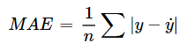

- What it shows – MAE measures the average magnitude of errors in the predictions made by the model (without considering their direction). 
- When to use – Use MAE when you want a simple, interpretable metric to evaluate the performance of your regression model. 
- When to avoid – Avoid using MAE to emphasize the impact of larger errors, as it does not penalize them heavily. 
- Package to use – [Scikit-learn](https://scikit-learn.org/stable/modules/generated/sklearn.metrics.mean_absolute_error.html)

### Mean Squarred Error (MSE) 
Mean Squared Error (MSE) is another commonly used metric for assessing the performance of regression models in machine learning and statistics. It measures the average squared difference between the predicted and actual values, thus emphasizing larger errors. MSE is particularly useful in applications where the goal is to minimize the impact of outliers or when the error distribution is assumed to be Gaussian. 

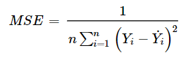

MSE provides a measure of model performance that penalizes larger errors more severely than smaller ones. A lower MSE indicates a better model fit, demonstrating that the model's predictions are, on average, closer to the true values. It is commonly used when comparing different models on the same dataset, as it can help identify the model with the most accurate predictions. 
- What it shows – MSE measures the average squared difference between the actual and predicted values, penalizing larger errors more heavily than smaller ones. 
- When to use – Use MSE when you want to place a higher emphasis on larger errors. 
- When not to use – Avoid using MSE if you need an easily interpretable metric or if your dataset has a lot of outliers, as it can be sensitive to them. 
- Package to use – [Scikit-learn](https://scikit-learn.org/stable/modules/generated/sklearn.metrics.mean_squared_error.html)

### Root Mean Squared Error (RMSE) 
The Mean Squared Error (MSE) square root measures the average squared difference between the predicted and actual values. Root Mean Squared Error (RMSE) has the same unit as the target variable, making it more interpretable and easier to relate to the problem context than MSE. 

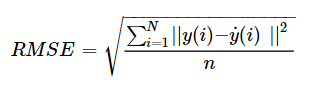

RMSE can provide a measure of model performance that balances the emphasis on larger errors (as in MSE) with interpretability (since it has the same unit as the target variable). A lower RMSE indicates a better model fit, showing that the model's predictions are, on average, closer to the true values. It is commonly used when comparing different models on the same dataset, as it can help identify the model with the most accurate predictions. 
- When to use – Use RMSE to penalize larger errors and obtain a metric with the same unit as the target variable. 
- When not to use – Avoid using RMSE if you need an interpretable metric or if your dataset has a lot of outliers. 
- Package to use – [Scikit-learn](https://scikit-learn.org/stable/modules/generated/sklearn.metrics.mean_squared_error.html), “Squared” parameter set to FALSE 

### R-Squared
R Squared (R2), also known as the coefficient of determination, measures the proportion of the total variation in the target variable explained by the model's predictions. R2 ranges from 0 to 1, with higher values indicating a better model fit. 

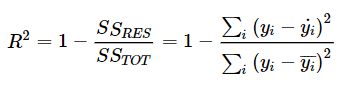
- What it shows – R-squared measures the proportion of the variance in the dependent variable that the model's independent variables can explain. 
- When to use – Use R-squared when you want to understand how well your model is explaining the variation in the target variable compared to a simple average. 
- When not to use – Avoid using it if your model has a large number of independent variables or if it is sensitive to outliers. 
- Package to use – [Scikit-learn](https://scikit-learn.org/stable/modules/generated/sklearn.metrics.r2_score.html)

### Mean Absolute Percentage Error (MAPE)
Mean absolute percentage error is calculated by taking the difference between the actual value and the predicted value and dividing it by the actual value. An absolute percentage is applied to this value and it is averaged across the dataset. MAPE is also known as Mean Absolute Percentage Deviation (MAPD). It increases linearly with an increase in error. The smaller the MAPE, the better the model performance. 

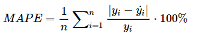
- What it shows – MAPE measures the proportion of the predicted value and dividing it by the actual value. It is a great tool to evaluate large numbers, for example prices.  
- When to use – Use MAPE when you want to understand how well your model is predicted the price and how far it is from the actual price 
- When not to use – Avoid using it if your model has a large number of independent variables or if it is sensitive to outliers. 
- Package to use – [Scikit-learn](https://scikit-learn.org/stable/modules/generated/sklearn.metrics.mean_absolute_percentage_error.html)

## Classification Metrics 
Classification metrics assess the performance of machine learning models for classification tasks. They aim to assign an input data point to one of several predefined categories. 

### Accuracy 
Accuracy is a fundamental evaluation metric for assessing the overall performance of a classification model. It is the ratio of the correctly predicted instances to the total instances in the dataset. The formula for calculating accuracy is: 

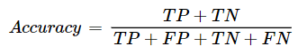 
- What it shows – Accuracy measures the proportion of correct predictions made by the model out of all predictions. 
- When to use – Accuracy is useful when the class distribution is balanced, and false positives and negatives have equal importance. 
- When not to use – If the dataset is imbalanced or the cost of false positives and negatives differs, accuracy may not be an appropriate metric. 
- Package to use – [Scikit-learn](https://scikit-learn.org/stable/modules/generated/sklearn.metrics.accuracy_score.html) 

### Confusion Matrix 
A confusion matrix, also known as an error matrix, is a tool used to evaluate the performance of classification models in machine learning and statistics. It presents a summary of the predictions made by a classifier compared to the actual class labels, allowing for a detailed analysis of the classifier's performance across different classes. 

It helps identify misclassification patterns and calculate various evaluation metrics such as precision, recall, F1-score, and accuracy. By analyzing the confusion matrix, you can diagnose the model's strengths and weaknesses and improve its performance. 
- What it shows – The confusion matrix provides a detailed breakdown of the model's performance, allowing us to identify specific types of errors. 
- When to use – Use a confusion matrix when you want to visualize the performance of a classification model and analyze the types of errors it makes. 
- Package to use – [Scikit-learn](https://scikit-learn.org/stable/modules/generated/sklearn.metrics.confusion_matrix.html)

### Precision and Recall 
Precision and recall are essential evaluation metrics in machine learning for understanding the trade-off between false positives and false negatives. Precision (P) is the proportion of true positive predictions among all positive predictions. It is a measure of how accurate the positive predictions are. Recall (R), also known as sensitivity or true positive rate (TPR), is the proportion of true positive predictions among all actual positive instances. It measures the classifier's ability to identify positive instances correctly.  

A high precision means the model has fewer false positives, while a high recall means fewer false negatives. Depending on the specific problem you're trying to solve, you might prioritize one of these metrics over the other. 

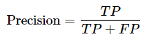

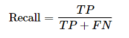
- What they show – Precision measures the proportion of true positive predictions among all positive predictions, while recall measures the proportion of true positive predictions among all actual positive instances. 
- When to use – Precision and recall are useful when the class distribution is imbalanced or when the cost of false positives and false negatives is different. 
- When not to use – Accuracy might be more appropriate if the dataset is balanced and the costs of false positives and negatives are equal. 
- Package to use – [Scikit-learn](https://scikit-learn.org/stable/auto_examples/model_selection/plot_precision_recall.html)

### F1-score 
The F1-score is the harmonic mean of precision and recall, providing a metric that balances both measures. It is beneficial when dealing with imbalanced datasets, where one class is significantly more frequent than the other. The formula for the F1 score is: 

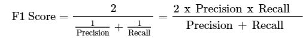
- What it shows – The F1-score is the harmonic mean of precision and recall, providing a metric that considers false positives and false negatives. 
- When to use – The F1-score is useful when the class distribution is imbalanced or when the cost of false positives and false negatives is different. 
- When not to use – Accuracy might be more appropriate if the dataset is balanced and the costs of false positives and negatives are equal. 
- Package to use – [Scikit-learn](https://scikit-learn.org/stable/modules/generated/sklearn.metrics.f1_score.html)

### Area Under the Receiver Operating Characteristic Curve (AU-ROC) 
The AU-ROC is a popular evaluation metric for binary classification problems. It measures the model's ability to distinguish between positive and negative classes. The ROC curve plots the true positive rate (recall) against the false positive rate (1 - specificity) at various classification thresholds. The AU-ROC represents the area under the ROC curve, and a higher value indicates better model performance. 

The significance of the AU-ROC lies in its ability to provide a comprehensive view of a model's performance across all possible classification thresholds. It considers the trade-off between true positive rate (TPR) and false positive rate (FPR) and quantifies the classifier's ability to differentiate between the two classes.  

A higher AU-ROC value indicates better performance, with a perfect classifier having an AU-ROC of 1 and a random classifier having an AU-ROC of 0.5. 
- What it shows – AU-ROC represents the model's ability to discriminate between positive and negative classes. A higher AU-ROC value indicates better classification performance. 
- When to use – Use AU-ROC to compare the performance of different classification models, especially when the class distribution is imbalanced. 
- When not to use – Accuracy might be more appropriate if the dataset is balanced and the costs of false positives and negatives are equal. 
- Package to use – Scikit-learn: [ROC Score](https://scikit-learn.org/stable/modules/generated/sklearn.metrics.roc_auc_score.html) & [ROC Curve Display](https://scikit-learn.org/stable/modules/generated/sklearn.metrics.RocCurveDisplay.html)

## Clustering Metrics 

### Silhouette Score 
It is a metric used to measure the quality of segmentation, providing a way to assess how separated the clusters are. A higher Silhouette Score means that the clusters are well-separated. It’s first calculated per data point, then an average score is provided for all data points.  

For each data point, we calculate two values: 1) a, the average difstance from the data point to all other data points within the same cluster, and 2) b, the smallest average distance from the data point to all data points in a diffferent cluster, not counting the data point’s own cluster. The score s for each data point is calculated as: 

 

The silhouette score is the average of the scores for all data points, typically falling in the range of –1 to 1. 
- What it shows – A higher score suggests that clusters are well-separated and distinct, providing a way to quantitatively assess the goodness of clustering. 
- When to use – Use it when you want to evaluate the quality of clustering results obtained from algorithms like K-Means or Hierarchical Clustering. It helps identify the optimal number of clusters (k). 
- When not to use – When dealing with non-spherical or complex cluster shapes, unclear cluster structures, or results with high-dimensional data, the score may not be as suitable. K-Means usually assumes spherical clusters, but DBSCAN and spectral clustering are typically used for non-spherical clusters. 
- Package to use – Scikit-learn's silhouette_score in the sklearn.metrics module, or specialized clustering libraries like HDBSCAN also offer Silhouette Score calculations. 

### Rand Index 
The Rand Index (RI) is used to evaluate the similarity between two clustering results, assessing how well two different segments agree or disagree in terms of assigning data points to clusters. The RI ranges from 0 to 1, with higher values indicating greater agreement between segments. 

It is computed based on the counts of data points that are 1) in the same cluster in both clusterings (a), 2) in different clusters in both clusterings (b), 3) in the same cluster in one clustering and in a different cluster in another clustering (c), and 4) in different clusters in one clustering and in the same cluster in another clustering (d). Thus, it is calculated by 

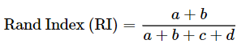
- What it shows – The RI quantifies if two different clusterings of the same dataset agree or disagree on where to assign data points to clusters. 
- When to use – Use when comparing the similarity between two different clustering solutions. It is valuable for measuring the consistency of clustering results from different methods or paramaeter settings. 
- When not to use – It is not useful when assessing the quality of a single clustering, or when dealing with imbalanced datasets. Also don’t do it when you don’t have a ground truth or a reference clustering to compare against. 
- Package to use – Scikit-learn provides an adjusted_rand_score in the sklearn.metrics module, while SciPy also has functions like sciy.cluster.vq.vq and scipy.spatial.distance.pdist 

### Mutual Information 
Mutual Information (MI) is a measure to quantify the degree of dependency between two random variables, In the context of clustering, it is useful when you have access to ground truth information about the true cluster assignments of data. MI can also be used for feature selection for clustering – features with high mutual information with target clustering labels are considered informative for distinguishing between clusters. It can also be used for feature weighting in other clustering algorithms like spectral clustering or affinity propagation. 

The MI between two random variables X and Y is calculated using the following formula: 

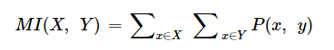
- What it shows – MI measures how well the clustering results agree with true or expected cluster assignment. Higher MI scores indicate better agreement. 
- When to use – Use MI when you have access to ground truth information, like true cluster labels or class labels for data. It can also be used to guide the feature selection process for clustering, and determine the number amount of clusters (k). 
- When not to use – It is not suitable when ground truth information is unavailable, as MI relies on having a reference clustering or class labels. You also need to ensure that the ground truth labels themselves are unreliable. 
- Package to use – Scikit-learn has a mutual_info_score from sklearn.metrics, while SciPy also have a mutual_info_score. 

### Calinski-Harabasz Score 
The Calinski-Harabasz metric is used to evaluate the quality of clustering, measuring how well-separated and distinct the clusters are. It is calculated based on the variance between-cluster and variance within-cluster, the higher the better. The formula is as follows:  

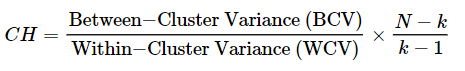

Where N is the number of data points and k is the number of clusters. Ideally, we want to maximize the BCV and minimze the WCV, while we also have a scaling factor that adjusts the score based on the number of clusters and data points. 
- What it shows – It measures how well-separated and distinct the clusters are in a clustering result; higher CH scores indicate that clusters are well-separated and have low WCV relative to BCV. 
- When to use – Use this when you want to evaluate and compare different clustering solutions. It is useful when you have no prior knowledge about the true clsuter assignments and need an objective measure of clustering quality. It can also determine the optimal number of clusters (k). 
- When not to use – When the ground truth is available, you may use other metrics like the Rand Index or Mutual Inofrmation. CH also assumes that clusters are roughly spherical and may not work when dealing with non-spherical complex cluster shapes.  
- Package to use – Scikit-learn has a calinski_harabasz_score in the sklearn.metrics module, while SciPy has scipy.spatial.distance.pdist to compute distances between data points. 

### Davies-Bouldin Index 
The Davies-Bouldin Index (DBI) is used to assess the quality of clustering results, measuring the average similarity between each cluster and its most similar neighboring cluster while considering the within-cluster scatter. DBI computes the ratio of the sum of average distances within each cluster to the maximum distance (dissimilarity) between any two cluster centroids. The lower the DBI value, the better the clustering solution is. 

To calculate DBI, you need k (number of clusters), Si (average distance between data points in cluster i and the centroid of cluster i), and Mij (distance between the centroids of clusters i and j):  

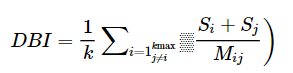
- What it shows – The DBI measures the average similarity between each cluster and its most similar cluster. Lower DBI values indicate better clustering quality. 
- When to use – Use DBI when comparing the quality of different clustering results or determining the optimal number of clusters for data. 
- When not to use – For non-convex or irregularly shaped clusters, you may use other metrics, as DBI assumes that clusters are roughly convex. It might also not perform well when clusters have significantly different sizes. 
- Package to use – Scikit-learn has a davies_bouldin_score in their sklearn.metrics.Error Analysis 