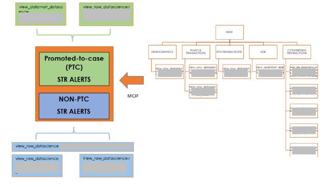
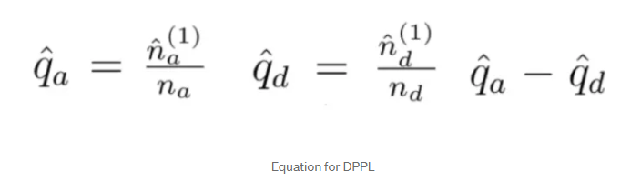
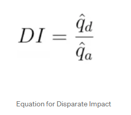
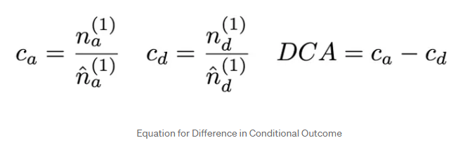
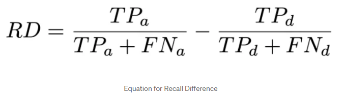
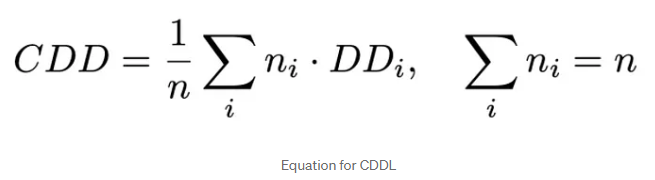
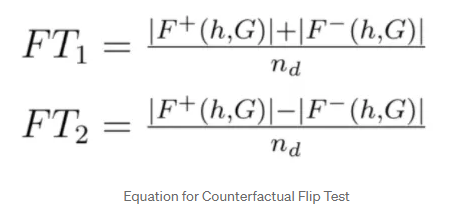

# XRAI Methodology - Model & Output (M&O) - Robustness
{: .no_toc }

## Table of contents
{: .no_toc .text-delta }

1. TOC
{:toc}

Robustness is the ability of a model to maintain its performance and make reliable predictions even when faced with variations, perturbations, or unexpected changes in the input data, model parameters, or environmental conditions. A robust machine learning model is one that is less sensitive to factors that could potentially disrupt its performance. 

## Quantitative Techniques
Achieving robustness in machine learning can involve various strategies and techniques, including: 
- <u>Attacks</u> 
    - **Evasion** – Also known as adversarial attacks, evasions try to manipulate input data that causes models to make incorrect predictions. These involve introducing small but carefully crafted perturbations to input samples, such that they are imperceptible to humans. 

    ```python
    # Function for creating model
    def create_model():
        # Defining the model
        model = tf.keras.models.Sequential([
            Conv2D(filters=32, kernel_size=3, activation="relu", input_shape=(28, 28, 1)),
            MaxPool2D(pool_size=2),
            Conv2D(filters=64, kernel_size=3, activation="relu"),
            MaxPool2D(pool_size=2),
            Flatten(),        
            Dense(units=10, activation="softmax")
        ])

        # Compiling the model
        model.compile(
            optimizer="adam",
            loss="categorical_crossentropy",
            metrics=["accuracy"]
            )

        # Returning the model
        return model

    # Instantiating the model
    model = create_model()

    # Training the model
    model.fit(
        x=train_images, 
        y=train_labels, 
        epochs=10,
        batch_size=256)

    # Creating a classifier by wrapping our TF model in ART's KerasClassifier class
    classifier = KerasClassifier(
        model=model, 
        clip_values=(min, max)
        )

    # Defining an attack using the fast gradient method
    attack_fgsm = FastGradientMethod(
        estimator=classifier, 
        eps=0.3
        )

    # Generating adversarial images from test images
    test_images_adv = attack_fgsm.generate(x=test_images)

    # Viewing an adversarial image
    plt.imshow(X=test_images_adv[0])

    # Evaluating the model on clean images
    score_clean = model.evaluate(
        x=test_images, 
        y=test_labels
        )

    # Evaluating the model on adversarial images
    score_adv = model.evaluate(
        x=test_images_adv, 
        y=test_labels
        )

    # Comparing test losses
    print(f"Clean test set loss: {score_clean[0]:.2f} " 
        f"vs adversarial set test loss: {score_adv[0]:.2f}")

    # Comparing test accuracies
    print(f"Clean test set accuracy: {score_clean[1]:.2f} " 
        f"vs adversarial test set accuracy: {score_adv[1]:.2f}")
    ```

    - **Poisoning** – This is when attackers insert malicious data points into the training set to influence the model’s behavior, leading it to make incorrect predictions or exhibit biased behavior. 
    
    ```python
    # Importing dependencies
    from art.attacks.poisoning import PoisoningAttackBackdoor, PoisoningAttackCleanLabelBackdoor
    from art.attacks.poisoning.perturbations import add_pattern_bd
    from art.utils import to_categorical

    # Defining a poisoning backdoor attack
    backdoor = PoisoningAttackBackdoor(perturbation=add_pattern_bd)

    # Defining a target label for poisoning
    target = to_categorical(
        labels=np.repeat(a=5, repeats=5), 
        nb_classes=10
        )

    # Inspecting the target labels
    print(f"The target labels for poisoning are\n {target}")


    # Poisoning sample data
    poisoned_images, poisoned_labels = backdoor.poison(
        x=train_images[:5], 
        y=target
        )

    # Creating a figure and axes for the poisoned images
    fig, axes = plt.subplots(
        nrows=1, 
        ncols=5, 
        squeeze=True, 
        figsize=(15, 5)
        )

    # Plotting the poisoned images
    for i in range(len(poisoned_images)):
        axes[i].imshow(X=poisoned_images[i])
        axes[i].set_title(label=f"Label: {np.argmax(poisoned_labels[i])}")
        axes[i].set_xticks(ticks=[])
        axes[i].set_yticks(ticks=[])    

    # Showing the plot
    plt.show()

    # Defining a target label for poisoning
    target = to_categorical(
        labels=[9], 
        nb_classes=10
        )[0]

    # Defining a clean label backdoor attack
    attack = PoisoningAttackCleanLabelBackdoor(
        backdoor=backdoor, 
        proxy_classifier=classifier,
        target=target, 
        pp_poison=0.75, 
        norm=2, 
        eps=5, 
        eps_step=0.1, 
        max_iter=200)


    # Poisoning training data
    poisoned_images, poisoned_labels = attack.poison(
        x=train_images[:10000], 
        y=train_labels[:10000]
        )

    # Getting the indices of the images
    # whose target corresponds to our backdoor target
    poisoned_indices = np.all(
            a=(poisoned_labels == target), 
            axis=1
            )

    # Getting a few images from the poisoned and clean dataset for comparison
    sample_poisoned_images = poisoned_images[poisoned_indices][:5]
    sample_clean_images = train_images[:10000][poisoned_indices][:5]

    # Defining a number of rows and columns for the plot
    nrows, ncols = 5, 2

    # Creating a figure and axes
    fig, axes = plt.subplots(
            nrows=nrows, 
            ncols=ncols, 
            figsize=(10, 25)
            )

    # Defining a counting variable
    counter = 0

    # Indicating the purpose of each column
    axes[0, 0].set_title(
            label="Images from the poisoned dataset", 
            pad=25
            )
    axes[0, 1].set_title(
            label="Images from the clean dataset", 
            pad=25
            )

    # Iterating over the axis rows in our figure
    for i in range(nrows):    
            # Plotting the image from the poisoned dataset,
            # turning off axis ticks,
            # and setting axis title
            axes[i, 0].imshow(sample_poisoned_images[counter])        
            axes[i, 0].set_xticks(ticks=[])
            axes[i, 0].set_yticks(ticks=[])
            

            # Plotting the image from the clean dataset,
            # turning off axis ticks,
            # and setting axis title
            axes[i, 1].imshow(sample_clean_images[counter])
            axes[i, 1].set_xticks(ticks=[])
            axes[i, 1].set_yticks(ticks=[])


            # Incrementing counter value
            counter += 1

    # Showing the plot
    plt.show()
    ```

    - **Extraction** – These are attempts by adversaries to extract sensitive information from the model, such as its parameters or the training data used. This is usually done by reverse-engineering its models or training data.
  
    ```python
    # Importing CopycatCNN
    from art.attacks.extraction import CopycatCNN

    # Setting aside a subset of the source dataset for the original model
    train_images_original = train_images[:50000]
    train_labels_original = train_labels[:50000]

    # Using the rest of the source dataset for the stolen model
    train_images_stolen = train_images[50000:]
    train_labels_stolen = train_labels[50000:]

    # Training the original model on its training subset
    model_original = create_model()
    model_original.fit(
        x=train_images_original,
        y=train_labels_original,
        epochs=10,
        batch_size=256
    )

    # Wrapping the model in the ART KerasClassifier class
    classifier_original = KerasClassifier(
        model=model_original,
        clip_values=(min, max))

    # Creating the "neural net thief" object that will steal the original classifier
    copycat_cnn = CopycatCNN(
        batch_size_fit=256,
        batch_size_query=256,
        nb_epochs=20,
        nb_stolen=len(train_images_stolen),
        classifier=classifier_original
        )


    # Creating a reference model for theft
    model_stolen = KerasClassifier(
        model=create_model(), 
        clip_values=(min, max)
        )


    # Extracting a thieved classifier by training the reference model
    stolen_classifier = copycat_cnn.extract(
        x=train_images_stolen, 
        y=train_labels_stolen, 
        thieved_classifier=model_stolen
        )

    # Testing the performance of the original classifier
    score_original = classifier_original._model.evaluate(
        x=test_images, 
        y=test_labels
        )

    # Testing the performance of the stolen classifier
    score_stolen = stolen_classifier._model.evaluate(
        x=test_images, 
        y=test_labels
        )

    # Comparing test losses
    print(f"Original test loss: {score_original[0]:.2f} " 
        f"vs stolen test loss: {score_stolen[0]:.2f}")

    # Comparing test accuracies
    print(f"Original test accuracy: {score_original[1]:.2f} " 
        f"vs stolen test accuracy: {score_stolen[1]:.2f}")

    # Initializing a dict to store scores
    scores = {}

    # Iterating over each data subset
    for data_subset in data_subsets_to_try:
        # Creating a reference model for theft
        model_stolen = KerasClassifier(
            model=create_model(), 
            clip_values=(0, 1)
            )

        # Creating the "neural net thief" object
        # to train with the current subset size
        copycat_cnn = CopycatCNN(
            batch_size_fit=256,
            batch_size_query=256,
            nb_epochs=20,
            nb_stolen=data_subset,
            classifier=classifier_original
        )

        # Extracting a thieved classifier,
        # using a subset of the stolen data
        stolen_classifier = copycat_cnn.extract(
            x=train_images_stolen[:data_subset], 
            y=train_labels_stolen[:data_subset], 
            thieved_classifier=model_stolen
            )

        # Calculating test metrics for the current stolen model
        scores[data_subset] = stolen_classifier._model.evaluate(
            x=test_images,
            y=test_labels
        )

    # Converting the dict values to a Python list
    score_values = list(scores.values())

    # Creating a matplotlib figure
    fig = plt.figure(figsize=(10, 10))

    # Iterating over our data subsets,
    # plotting the test loss for each
    for i in range(len(data_subsets_to_try)):
        plt.bar(
            x=str(data_subsets_to_try[i]), 
            height=score_values[i][0]
            )

    # Setting a title for the figure and showing it
    plt.title(label="Test loss of the stolen classifiers based on the number of stolen samples")
    plt.xlabel(xlabel="Subset size")
    plt.ylabel(ylabel="Test loss")
    plt.show()
    ```

    - **Inference** – These attacks aim on understanding the model’s behavior and decision-making processes, such as gaining insights on how the model responds to certain inputs. These attacks are concerned with analyzing the model’s predictions and decision boundaries. 

    ```python
    # Importing dependencies
    from art.attacks.inference.model_inversion import MIFace

    # Defining a model inversion attack
    attack = MIFace(
        classifier=classifier,
        max_iter=2500,
        batch_size=256)


    # Defining the target labels for model inversion
    y = np.arange(start=0, stop=10)

    # Inspecting the target labels
    print(y)


    # Defining an initialization array for model inversion
    x_init_average = np.zeros(shape=(10, 28, 28, 1)) + np.mean(a=test_images, axis=0)

    # Checking class gradients
    class_gradient = classifier.class_gradient(
        x=x_init_average, 
        label=y
        )

    # Reshaping class gradients
    class_gradient = np.reshape(
        a=class_gradient, 
        newshape=(10, 28*28)
        )

    # Obtaining the largest gradient value for each class
    class_gradient_max = np.max(class_gradient, axis=1)

    # Inspecting class gradients
    print(class_gradient_max)

    %%time

    # Running model inversion
    x_infer_from_average = attack.infer(
        x=x_init_average, 
        y=y
        )

    # Creating a figure and axes for our plot
    fig, axes = plt.subplots(
        nrows=nrows, 
        ncols=ncols, 
        figsize=(20, 10)
        )

    # Declaring a counting variable
    counter = 0

    # Iterating over the axes and plotting the inferred images in them
    for i in range(nrows):
        for j in range(ncols):        
            axes[i, j].set_xticks(ticks=[])
            axes[i, j].set_yticks(ticks=[])
            axes[i, j].imshow(X=x_infer_from_average[counter])

            # Incrementing the counter
            counter += 1

    # Showing the plotted axes
    plt.show()
    ```

- <u>Defenses</u> 
    - **Preprocessing** – Some techniques include removing any potentially sensitive information or PIIs, introducing random noise to training data, normalizing and scaling features, anomaly detection to filter out potentially malicious points, and applying privacy-preserving techniques such as federated learning. 

    ```python

    # Importing dependencies
    from art.defences.preprocessor import TotalVarMin

    # Initializing the defense
    defense = TotalVarMin(    
        norm=1
    )

    # Running the defense on adversarial images
    test_images_fgm_cleaned = defense(test_images_fgm[:1000])[0]

    # Defining a number of rows and columns for the plot
    nrows, ncols = 5, 2

    # Creating a plot figure and axes for the samples
    fig, axes = create_figure_axes(
        nrows=nrows, 
        ncols=ncols, 
        figsize=(10, 25)
        )

    # Defining a counting variable
    counter = 0

    # Indicating the purpose of each column
    axes[0, 0].set_title(
            label="Adversarial images", 
            pad=25
            )
    axes[0, 1].set_title(
            label="Cleaned images", 
            pad=25
            )

    # Iterating over the axis rows in our figure
    for i in range(nrows):    
            # Plotting the adversarial image,
            # turning off axis ticks,
            # and setting the axis title
            axes[i, 0].imshow(test_images_fgm[counter])        
            axes[i, 0].set_xticks(ticks=[])
            axes[i, 0].set_yticks(ticks=[])
            

            # Plotting the cleaned image,
            # turning off axis ticks,
            # and setting the axis title
            axes[i, 1].imshow(test_images_fgm_cleaned[counter])
            axes[i, 1].set_xticks(ticks=[])
            axes[i, 1].set_yticks(ticks=[])


            # Incrementing counter value
            counter += 1

    # Showing the plot
    plt.show()


    # Evaluating the performance of the vulnerable classifier on adversarial and cleaned images
    score_fgm = vulnerable_classifier._model.evaluate(x=test_images_fgm[:1000], y=test_labels_original[:1000])
    score_fgm_cleaned = vulnerable_classifier._model.evaluate(x=test_images_fgm_cleaned, y=test_labels_original[:1000])

    # Comparing test losses
    print("------ TEST METRICS ON ADVERSARIAL AND CLEANED IMAGES ------")
    print(f"Test loss on adversarial images: {score_fgm[0]:.2f} " 
        f"vs test loss on cleaned images: {score_fgm_cleaned[0]:.2f}")

    # Comparing test accuracies
    print(f"Test accuracy on adversarial images: {score_fgm[1]:.2f} " 
        f"vs test accuracy on cleaned images: {score_fgm_cleaned[1]:.2f}")
    ```

    - **Model Training** – Some techniques include training the model on a mixture of clean and intentionally adversarial examples, applying gradient regularization or using more robust loss functions (e.g. Huber loss and Wasserstein loss), utilizing probabilistic labels instead of hard labels (e.g. 0 or 1), and having weight regularization techniques. 

    ```python
    # Importing dependencies
    from art.defences.trainer import AdversarialTrainer
    from art.attacks.evasion import FastGradientMethod

    # Initializing a vulnerable classsifier
    vulnerable_classifier = KerasClassifier(
        model=create_model(), 
        clip_values=(min, max)
        )

    # Initializing a robust classifier
    robust_classifier = KerasClassifier(
        model=create_model(), 
        clip_values=(min, max)
        )

    # Training the vulnerable classifier
    vulnerable_classifier.fit(
        x=train_images_original[:10000], 
        y=train_labels_original[:10000], 
        nb_epochs=10
        )


    # Initializing a Fast Gradient Method attack
    attack_fgm = FastGradientMethod(
        estimator=vulnerable_classifier, 
        eps=0.15
        )

    # Initializing an adversarial trainer to train a robust model
    trainer = AdversarialTrainer(
        classifier=robust_classifier, 
        attacks=attack_fgm, 
        ratio=0.5
        )

    # Training the robust classifier
    trainer.fit(
        x=train_images_original[:10000], 
        y=train_labels_original[:10000],
        nb_epochs=10
        )


    # Generating adversarial samples
    test_images_fgm = attack_fgm.generate(x=test_images_original)

    # Evaluating the performance of the vulnerable classier on clean and adversarial images
    score_clean = vulnerable_classifier._model.evaluate(x=test_images_original, y=test_labels_original)
    score_fgm = vulnerable_classifier._model.evaluate(x=test_images_fgm, y=test_labels_original)

    # Comparing test losses
    print("------ TEST METRICS OF VULNERABLE MODEL ------")
    print(f"Clean test loss: {score_clean[0]:.2f} " 
        f"vs FGM test loss: {score_fgm[0]:.2f}")

    # Comparing test accuracies
    print(f"Clean test accuracy: {score_clean[1]:.2f} " 
        f"vs FGM test accuracy: {score_fgm[1]:.2f}")


    # Evaluating the performance of the robust classifier on adversarial images
    score_robust_fgm = robust_classifier._model.evaluate(x=test_images_fgm, y=test_labels_original)

    # Comparing test losses
    print("------ TEST METRICS OF ROBUST VS VULNERABLE MODEL ON ADVERSARIAL SAMPLES ------")
    print(f"Robust model test loss: {score_robust_fgm[0]:.2f} " 
        f"vs vulnerable model test loss: {score_fgm[0]:.2f}")

    # Comparing test accuracies
    print(f"Robust model test accuracy: {score_robust_fgm[1]:.2f} " 
        f"vs vulnerable model test accuracy: {score_fgm[1]:.2f}")
    ```

    - **Postprocessing** – Data scientists can try filtering out potentially sensitive or malicious outputs, adding confidence thresholds for model predictions, combining predictions from an ensemble of models, and re-ranking predictions based on additional criteria (e.g. image quality, content analysis). 
  
    ```python

    # Importing dependencies
    from art.defences.postprocessor import ReverseSigmoid
    from art.attacks.extraction import CopycatCNN

    # Setting aside a subset of the source dataset for the original model
    train_images_victim = train_images_original[:50000]
    train_labels_victim = train_labels_original[:50000]

    # Using the rest of the source dataset for the stolen model
    train_images_stolen = train_images_original[50000:]
    train_labels_stolen = train_labels_original[50000:]

    # Creating and training a  classifier with the original clean data
    model = create_model()
    model.fit(
        x=train_images_victim, 
        y=train_labels_victim, 
        epochs=10
        )

    # Initializing the postprocessor
    postprocessor = ReverseSigmoid(
        beta=1.0, 
        gamma=0.2
        )

    # Creating an instance of an unprotected classifier
    unprotected_classifier = KerasClassifier(
        model=model,
        clip_values=(min, max))

    # Creating an instance of a protected classifier
    protected_classifier = KerasClassifier(
        model=model,
        clip_values=(min, max),
        postprocessing_defences=postprocessor)


    # Getting predictions for the unprotected model
    unprotected_predictions = unprotected_classifier.predict(x=test_images_original[:10])

    # Inspecting unprotected predictions
    print("----- ONE-HOT PREDICTIONS -----", "\n", unprotected_predictions, "\n")
    print("----- CLASS PREDICTIONS -----", "\n", np.argmax(a=unprotected_predictions, axis=1))


    # Getting predictions for the protected model
    protected_predictions = protected_classifier.predict(x=test_images_original[:10])

    # Inspecting protected predictions
    print("----- ONE-HOT PREDICTIONS -----", "\n", protected_predictions, "\n")
    print("----- CLASS PREDICTIONS -----", "\n", np.argmax(a=protected_predictions, axis=1))
    ```

## Data Flow Diagrams (DFDs)
Data Flow Diagrams (DFDs) enable us to showcase to users and stakeholders the customized tools and processes we use to achieve maximum value from the data, and how we reach our final decision-making.  



DFDs are graphical representation of data flows through the AI system. This will include data stores and any data movement through subprocesses.  

Scikit-learn offers a display of the multiple processes / functions used during model development. The visual display of each step taken to prepare the data, tune the model and transform the predictions, will enable developers and users to evaluate specific data transformations and model configurations. This will further ensure consistency and reproducibility when data or model is being updated.   

## Qualitative Inspection 
Process checks include verifying documentary evidence of having a strategy for the selection of fairness metrics that are aligned with desired outcomes, and the definition of sensitive attributes are consistent with legislation and corporate values. Establish qualitative guidance on how models should be classified. For example, adopting a framework to classify models ‘can result in systematic disadvantage to individuals or groups’ to have ‘high impact’, while models with outputs that are ‘benign and customers can opt in/out’ to be of ‘low impact’. 

Other relevant details during the modeling process should, if necessary, be disclosed to ensure transparency to users and other stakeholders. Examples of relevant details can be:  
- **Coverage period**, which refers to the period when the model is trained and tested. This helps ensure that the coverage period represents the data the model was trained on and that it is reliable and accurate.  
- The **portfolios or products** that the model is intended for use should be reported. This includes specifying the type of data that the model was trained on (such as numerical data, text, or images, etc). The data's context or domain should be considered to ensure the model is appropriate for the specific application.  
- **Exceptions** are cases where the model would perform differently from the norm. This can include edge cases or unexpected events. This is important to inform and explain to users how the model will handle these exceptions. 

## Examine model output for unintended bias and uncertainties 
After training the ML model, we gain the predicted probabilities from the model and the predicted labels. An additional set of bias metrics can be calculated and analyzed for bias. This is to inspect any disparities in outcomes despite checks for class imbalance before training. Some examples include: 
- Difference in positive proportions in predicted labels (DPPL) - This statistic is simply looking at the difference in the ratio of positive cases to total sample amounts between advantaged and disadvantaged groups. That is to say, we’ll look at the number of positive cases for the advantaged group, n_a(1), and compare that to the total number of positive samples we have, n_a. Next, we’ll do the same thing and compare the number of positive cases in the disadvantaged group, n_d(1), and compare that to the total number of disadvantaged samples we have, n_d. This is a valuable metric because it tells us the relatively likelihood of members from both the advantaged and the disadvantaged group to fall into the positive class.

- Disparate (Adverse) Impact (DI) - In the disparate (adverse) impact statistic, we simply divide the q_d term by the q_a term to assess the magnitude of this difference. There is some legal precedent for considering a result on this statistics in the range of [4/5, 5/4] as being fair.

- Difference in conditional outcome (DCO) - This statistic looks at the relationship between the actual labels and the predicted labels, and helps us see if they are the same across classes. In the case of DCA, we’re looking at this in the case of accepted samples. In the case of DCR, we’re doing the same thing for rejected samples. This helps us pick on the type of bias when a lender may be giving more loans to men than prescribed by a model, but fewer loans to women than prescribed by the model.

- Recall Difference (RD) - This term helps us understand how well the model is performing in terms of recall within both the advantaged and disadvantaged groups. It may be the case that recall is high for a model only within the advantaged group, but low within the disadvantaged group, meaning it’s better at finding positive samples there. The terms mentioned here come from a confusion matrix — a common table used to identify true positives (TP), true negatives (TN), false positives (FP), and false negatives (FN), for a given confidence level within a set of predictions. This is well defined elsewhere, so we won’t define them here.
 
- Treatment Equality (TE) - This statistic looks at the difference in the ratio of false positives to false negatives between the advantaged and disadvantaged groups. You may have cases where both groups have the same levels of accuracy, but different ratios of false accepts to rejects. For example, let’s say 100 men and 8 women apply for a loan. Out of those, 8 men were wrongly denied, while 6 were wrongly approved. For women, 5 were wrongly denied, but only 2 were wrongly approved. Using a treatment equality statistic brings this to the forefront.
 
- Conditional Demographic Disparity in Predicted Labels (CDDPL) - The conditional demographic disparity in labels helps us understand whether the disadvantaged group has a larger proportion of rejected outcomes than accepted outcomes. This statistic uses the demographic disparity statistic, or DD, which is the difference between the proportion of rejected outcomes and the proportion of accepted outcomes for a given group. The conditional demographic disparity in labels statistic looks at the weighted average of DD across different groups, each weighted by its size.
 
- Counterfactual Fliptest (FT) - This metric looks at pairs of similar candidates across advantaged and disadvantaged groups, and helps us understand whether or not the model treats them the same. Typically these pairs are chosen using k-nearest neighbors — that is to say, the F+ and F- actually refer to similar pairs of data objects selected via KNN based on alternate samples.


**AI predictions always contain a level of uncertainty**, due to imperfect and noisy data, and the presence of incomplete distribution of possible data points. For example, predicting traffic congestion at 5:00AM, would carry a high level of uncertainty, since the training/test data is collected from 6:00AM to midnight. ML models need to present uncertainties to end-users for better explainability, provide indicators during decision making, and identify limitations of the AI-enabled system. Providing an estimate of uncertainties when using AI models is already mandatory in some domains (like medicine) as proposed by the European Commission​ [(European Commission, 2021)](https://eur-lex.europa.eu/legal-content/EN/TXT/?uri=celex%3A52021PC0206).​ In any case, quantifying and reporting uncertainties will build trust with the use of AI models. Quantification methods to determine uncertainties can be based on resampling methods, such as the distribution of the leave-one-out residuals estimated by perturbed models. Other methods include the Jackknife+ method, which presents a confidence interval that a new observation would lie within a prediction interval [​(Barber et al., 2019)​](https://arxiv.org/pdf/1905.02928.pdf).  

## Performance vs perceived goodness of explanation 
There might be trade-offs between quantitative estimates of a system’s performance and XRAI objectives. For example, ML models with high performance are often based on complex algorithms with low explainability, and vice versa. While XRAI objectives can fill the gap between complexity and interpretability, a lot is still dependent on how the end-user will integrate the given information with the decision-making. The choice of models being utilized and deployed will depend on the specific context and goals of the project in each DS team. Nevertheless, we encourage DS teams to intentionally design ML systems that maximize both model performance and explainability [(Rodolfa et al., 2021)](https://www.nature.com/articles/s42256-021-00396-x). 

To evaluate how end-users evaluate and perceive explainability, satisfaction of explainability can be performed by receiving feedback from developers, users, stakeholders, etc, with the use of Explanation Goodness Checklist, Explanation Satisfaction Scale, Trust Scales [​(Hoffman et al., 2018)​](https://arxiv.org/ftp/arxiv/papers/1812/1812.04608.pdf). To determine possible trade-offs between performance and interpretability, we can provide estimates such as percentage likelihood in probability of harm, which will help to align understanding across different stakeholders who perform and validate those assessments. 