# XRAI Methodology - Model & Output (M&O) - Stability
{: .no_toc }

## Table of contents
{: .no_toc .text-delta }

1. TOC
{:toc}

Stability refers to the reliability and consistency of a model's predictions when faced with variations or changes in input data, model parameters, or other factors. A stable model is less affected by minor data fluctuations, making it robust, better at generalizing to new data, and more interpretable. Achieving stability involves techniques such as: 
- **Robust data preprocessing**, such as [outlier detection and handling](https://scikit-learn.org/stable/modules/outlier_detection.html), [missing data imputation](https://scikit-learn.org/stable/modules/impute.html), and [data scaling](https://machinelearningmastery.com/standardscaler-and-minmaxscaler-transforms-in-python/), can make models less sensitive to variations in input data 
- **Regularization methods**, like [L1 (Lasso) and L2 (Ridge) regularization](https://neptune.ai/blog/fighting-overfitting-with-l1-or-l2-regularization) can reduce model complexity, preventing overfitting 
- **Ensemble methods**, such as [bagging and boosting](https://towardsdatascience.com/ensemble-learning-bagging-and-boosting-23f9336d3cb0), combine multiple models to reduce variance and increase stability 
- **Hyperparameter tuning**, with [grid search or random search](https://machinelearningmastery.com/hyperparameter-optimization-with-random-search-and-grid-search/),can lead to more stable model performance 
- **Cross-validation**, like [k-fold cross-validations](https://scikit-learn.org/stable/modules/cross_validation.html), helps assess a model’s stability through evaluating its performance on multiple data subsets 

Stable models are crucial in applications where reliability and consistency are essential, such as for fairness, interpretability, and making critical decisions based on machine learning predictions. Here are some metrics and tests related to stability: 

## Population Stability Index 
The Population Stability Index (PSI) is a statistical metric used in various fields, including credit risk modeling, fraud detection, and other domains where predictive models are developed and monitored over time. It's used to assess the stability or consistency of the distribution of a certain variable (often a predictive score or a risk indicator) between two different populations or time periods. 

The primary purpose of PSI is to identify whether there has been a significant change in the distribution of a variable between a baseline (reference) population and a new (comparison) population, or between two different time periods. This change could indicate shifts in the underlying characteristics of the populations being compared and might suggest that the predictive model is no longer performing as expected due to changing circumstances. 

The formula to calculate PSI involves comparing the expected and observed frequencies of a variable within different segments of the populations being compared. The general steps to calculate PSI are as follows: 

1. Divide the data into bins or segments based on the variable of interest (such as a predictive score). 
2. Calculate the expected and observed frequencies of the variable within each bin for both the baseline and comparison populations (or time periods). 
3. Calculate the percentage contribution of each bin to the overall PSI, using the formula:   

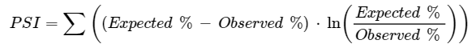

{:style="counter-reset:none"}
1. Sum up the contributions from all bins to get the total PSI. 

The PSI value indicates the level of change between the populations or time periods being compared.  Generally, a lower PSI indicates stability or minimal change, while a higher PSI suggests that there has been a significant shift in the distribution of the variable. The threshold for what constitutes a "significant" change can depend on the context and the specific application.

To implement this into your code, you can simply utilized the [DropHighPSIFeatures](https://feature-engine.trainindata.com/en/latest/user_guide/selection/DropHighPSIFeatures.html) of the feature-engine package. From that class, you can extract the PSI values per feature and the features to drop.

## Page-Hinkley 
Page-Hinkley is a statistical method used for change detection in time-series data. It's particularly useful for identifying abrupt or sudden changes in the statistical properties of a sequence of observations. This method is commonly employed in fields such as quality control, anomaly detection, and surveillance, where detecting unexpected shifts in data patterns is crucial. 

The Page-Hinkley test is designed to monitor the cumulative sum (CUSUM) of deviations between the observed values and a reference (expected) value. It operates by calculating a running sum of the differences between observed values and the reference value. If the sum exceeds a certain threshold, it indicates a potential change in the underlying process generating the data. 

Here's a simplified outline of how the Page-Hinkley method works: 
1. Initialization: Set a threshold value (h) and an incremental constant (λ). These values determine the sensitivity of the test. 
2. Calculation of the Page-Hinkley statistic (PH): 
- Start with an initial sum value, often set to zero. 
As new data points arrive, calculate the absolute deviation between the observed value and the reference value. 
- Update the sum by adding the deviation and subtracting λ from it. 
- If the sum becomes negative, reset it to zero (this prevents the sum from accumulating indefinitely). 

{:style="counter-reset:none"}
3. Change Detection: 
- If the calculated PH statistic exceeds the predefined threshold (h), it indicates a change point in the data. 
- The location and timing of this change point can help identify when the data behavior shifted significantly. 
- The Page-Hinkley method is capable of quickly detecting abrupt changes in a time series. It's advantageous for scenarios where immediate action is needed based on detecting sudden shifts. However, like any statistical method, it has limitations, such as sensitivity to parameter choices and its reliance on a fixed reference value.

Scikit Multiflow offers a function that can easily extract the Page Hinkley values.  For more information, click this [link](https://scikit-multiflow.readthedocs.io/en/stable/api/generated/skmultiflow.drift_detection.PageHinkley.html).

## Kolmogorov-Smirnov (K-S) Test 
The K-S test is a nonparametric test that compares the cumulative distributions of two data sets, in this case, the training data and the post-training data. To evaluate, the expected frequencies for each cell under the assumption of independence (i.e., if there is no association between the variables).  

First, calculate the ECDF of the sample data. The ECDF is a step function that assigns a cumulative probability to each data point. For a given data point x, the ECDF is defined as: 

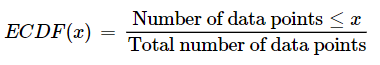

Determine the CDF of the specified theoretical distribution. The form of the CDF depends on the specific distribution being tested. Then, calculate the K-S statistic (�D) as the maximum absolute vertical distance between the ECDF and the CDF: 

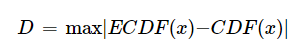 

Where D is the K-S statistic, ECDF(x) is the value of the ECDF at data point x, and CDF(x) is the value of the CDF at data point x. Finally, take the maximum absolute difference across all data points, then determine the critical value for the K-S statistic based on your chosen significance level (�α) and the sample size. 

To extract the KS Test values, you can utilize the Scipy's [kstest](https://docs.scipy.org/doc/scipy/reference/generated/scipy.stats.kstest.html) method.

## Chi-Square Test 
The chi-square test is a statistical method used to determine if there's a significant association between categorical variables. It assesses whether the observed frequencies in a contingency table differ significantly from the expected frequencies, assuming the variables are independent. This test is used to analyze relationships between categorical variables, select relevant features for machine learning, verify feature independence, and perform goodness-of-fit tests. In machine learning, it helps identify significant associations between variables and provides insights into data patterns.  

To calculate, the expected frequencies for each cell under the assumption of independence (i.e., if there is no association between the variables). The expected frequency for a cell is calculated as: 

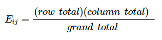 

Where Eij is the expected frequency for cell (i, j).

We then calculate the chi-squared statistic using the formula: 

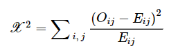

Where X2 is the chi-squared statistic, Oij is the observed frequency (count) for cell (i, j), and Eij is the expected frequency for cell  (i, j). Determine the degrees of freedom (df) for the chi-squared test. The degrees of freedom depend on the dimensions of the contingency table and are calculated as (r−1)(c−1), where r is the number of rows and cc is the number of columns in the table. Determine the critical value from the chi-squared distribution table based on your chosen significance level (𝛼) and degrees of freedom (df). 

It is used for categorical data. While useful, it's essential to interpret results carefully and consider other methods for more complex scenarios. 

Similar to KS test, the Scipy package also have a method for Chi-Square test, named [chisquare](https://docs.scipy.org/doc/scipy/reference/generated/scipy.stats.chisquare.html).

## Z-test 
The z-test is a statistical hypothesis test used to assess whether a sample mean differs significantly from a known population mean when the population standard deviation is known. It compares the difference between the sample mean and the population mean in terms of standard errors. It is used for categorical data only. 

In machine learning, the z-test is not as commonly used as other statistical methods. Many machine learning applications involve complex data with unknown population parameters, making the t-test or other techniques more suitable for hypothesis testing in such cases. 

However, it can be applied in specific cases, such as: 
1. **A/B Testing**: In A/B testing scenarios, where you're comparing the performance of two versions (A and B) of a product or service, the z-test can help determine if observed differences in metrics (like click-through rates) between the versions are statistically significant. 
2. **Feature Engineering Validation**: If you're introducing a new feature to your model and you have a solid understanding of the population distribution, you might use the z-test to validate whether the mean of the feature in your sample significantly differs from the population mean. 
3. **Model Evaluation Metrics**: In some cases, you might use the z-test to compare the performance of different machine learning models. For example, if you're comparing the means of two sets of model evaluation metrics (like accuracy) on separate datasets, the z-test could help assess if one model performs significantly better than the other. 

The formula for the one-sample z-test is as follows: 

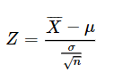 

Where Z is the z-test statistic, ˉXˉ is the sample mean, μ is the population mean (the mean under the null hypothesis), σ is the population standard deviation (known), and n is the sample size. With this, calculate the sample mean ˉXˉ and the sample size n from your data. Specify the population mean μ under the null hypothesis and the population standard deviation σ. Finally, calculate the z-test statistic using the formula above. Determine the critical value from the standard normal distribution (Z-distribution) based on your chosen significance level (𝛼) and the test type (one-tailed or two-tailed). 

To perform z-test in python, you can leverage the [ztest](https://www.statsmodels.org/dev/generated/statsmodels.stats.weightstats.ztest.html) function by the statsmodels package.

## Wasserstein Distance 
The Wasserstein Distance, also known as the Earth Mover's Distance (EMD) or Kantorovich-Rubinstein metric, is a measure of dissimilarity between probability distributions. It quantifies the "cost" of transforming one distribution into another by computing the minimum amount of work needed to move mass from each point in one distribution to its corresponding point in the other distribution. 

The Wasserstein distance W(P, Q) between distributions P and Q is computed as follows: 

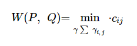

Where 𝛾 is a transportation plan, which is a matrix where γij represents the amount of mass transported from event i in distribution P to event j in distribution Q, cij represents the cost of transporting one unit of mass from event i to event j. This cost is often determined by the distance between the events, such as the Euclidean distance. The transportation plan 𝛾 must satisfy certain constraints: 
- The sum of γij over all i must be less than or equal to the mass Pi for all I; 
- The sum of γij over all j must be less than or equal to the mass Qj for all j. 
- The total mass transported must equal the minimum of the total mass in P and the total mass in Q. 

Calculating the Wasserstein distance involves solving a linear programming problem to find the transportation plan 𝛾 that minimizes the total cost while satisfying the constraints. This can be done using optimization algorithms like the simplex algorithm or interior-point methods. 

For the extraction of the Wasserstein Distance, you can use Scipy's [wasserstein_distance](https://docs.scipy.org/doc/scipy/reference/generated/scipy.stats.wasserstein_distance.html) method.

## Kullback-Leibler Divergence 
The Kullback-Leibler (KL) divergence measures how one probability distribution differs from another. It quantifies information lost when approximating one distribution with another.  

The KL Divergence from one distribution to another is calculated as: 

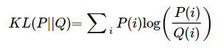

Where P(i) and Q(i) are the probabilities associated with event i in distributions P and Q, respectively. 

The sum is taken over all events in the distributions. KL divergence is used to assess how robust models, algorithms, or data transformations are against changes in input data distribution. It helps detect domain shifts, distributional changes, noise impact, and more. A lower KL divergence indicates greater similarity and stability between distributions. KL divergence aids in understanding how models behave under different conditions, ensuring reliability and informed decision-making in machine learning.

The Scipy package also have a method for KL Divergence. Click this [link](https://docs.scipy.org/doc/scipy/reference/generated/scipy.special.kl_div.html) for more information.

## Jensen-Shannon Distance 
The Jensen-Shannon distance (JSD) is a smoothed and symmetrized version of the Kullback-Leibler divergence, measuring the similarity or difference between probability distributions. 

Consider two discrete probability distributions, P and Q, over the same set of events or categories. The Jensen-Shannon Distance is defined as the square root of the Jensen-Shannon Divergence: 

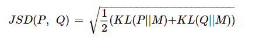

Where KL(P \\ M) is the KL Divergence from distribution P to the average distribution M, and KL(Q \\ M) is the KL Divergence from distribution Q to M. The average distribution M is computed as the average of P and Q: 

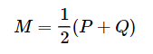

The JSD ranges from 0 (when P and Q are identical) to 1 (when P and Q are completely dissimilar). The Jensen-Shannon Distance has desirable properties, including symmetry 

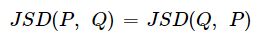

and the triangle inequality, making it a useful metric for comparing probability distributions. A smaller JSD signifies greater similarity and stability between distributions. JSD aids in comprehending model behavior under diverse conditions, contributing to reliable and informed decision-making in machine learning applications.

To solve for the JSD values, Scipy package also have the [jensenshannon](https://docs.scipy.org/doc/scipy/reference/generated/scipy.spatial.distance.jensenshannon.html) method.

## Anderson-Darling Test 
The Anderson-Darling test is a statistical hypothesis test used to assess whether a given data sample comes from a specific distribution, typically the normal distribution. It evaluates the goodness-of-fit between the observed data and a theoretical distribution by computing a test statistic based on the differences between observed and expected cumulative distribution functions (CDFs). 

The Anderson-Darling test involves testing two hypotheses: 
- Null Hypothesis (H0): The data follows a specified theoretical distribution (e.g., the normal distribution). 
- Alternative Hypothesis (H1): The data does not follow the specified distribution. 

The test statistic for the Anderson-Darling test is calculated as follows: 

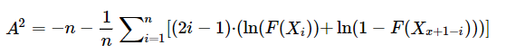

Where A2 is the Anderson-Darling test statistic, n is the sample size, Xi represents the ith smallest data point in the sample, and F(Xi) is the cumulative distribution function (CDF) of the specified theoretical distribution evaluated at Xi. 

To calculate, arrange the data in ascending order to obtain X1≤X2≤…≤Xn. Calculate the cumulative distribution function (CDF) values for each data point based on the specified theoretical distribution. Calculate the test statistic A2 using the formula above. Determine the critical values for the Anderson-Darling test statistic based on the chosen significance level (𝛼) and the null distribution of the statistic, which depends on the specific theoretical distribution being tested. 

The Anderson-Darling test is commonly used to assess the goodness-of-fit of data to a theoretical distribution, especially when you want to detect deviations from the distribution in the tails. 

For this statistical test, Scipy also have a specific [method](https://docs.scipy.org/doc/scipy/reference/generated/scipy.stats.anderson.html) to use for the extraction of the values.

## Fisher’s Exact Test 
Fisher's Exact Test is a statistical test used to determine the significance of association between two categorical variables in a 2x2 contingency table. It calculates the probability of observing a distribution of frequencies as extreme as or more extreme than the one actually observed, assuming that the variables are independent. 

|   |  VarA1  |  VarA2  |    |
| --- | --- |  --- | --- | 
| **VarB1** | A | B | A + B |
| **VarB2** | C | D | C + D |
|   | A + C | B + D | N |

Fisher's Exact Test involves testing two hypotheses: 
- Null Hypothesis (H0): There is no association between the two categorical variables; the distribution of data in the table is due to chance. 
- Alternative Hypothesis (H1): There is an association between the two categorical variables; the observed distribution is not due to chance. 

The probability of observing the data in the contingency table under the null hypothesis (H0) is calculated using the hypergeometric probability formula. This test aids in detecting shifts in data characteristics, changes in model behavior, and variations due to input changes. By using this test, practitioners can make informed decisions, monitor stability, and identify potential concerns in their machine learning applications. 

For this statistical test, Scipy also have a specific [method](https://docs.scipy.org/doc/scipy/reference/generated/scipy.stats.fisher_exact.html) to use for the extraction of the values.

## Cramer-von-Mises 
The Cramér-von Mises (CvM) test is a statistical test used in machine learning and statistics to assess the goodness of fit of a model's predictions to a particular probability distribution. It is a non-parametric test that measures the discrepancy between the empirical distribution of a sample and the cumulative distribution function (CDF) of a theoretical distribution, often the normal distribution. 

The Cramér-von Mises (CvM) test statistic measures the discrepancy between the empirical distribution of a sample and the cumulative distribution function (CDF) of a theoretical distribution, typically the normal distribution. The formula for the CvM test statistic is as follows: 

For a sample of n observations X1, X2, …, Xn, sorted in ascending order: 

1. Calculate the empirical distribution function (EDF), denoted as Sn(x), which represents the proportion of observations less than or equal to x: 

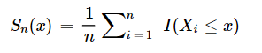

Where I(⋅) is the indicator function that equals 1 if the condition is true and 0 otherwise. 

{:style="counter-reset:none"}
1. Calculate the CDF of the theoretical distribution you are testing against, denoted as 
F(x)
2. Compute the CvM test statistic W2 as the integral of the squared difference between the EDF and the CDF over the entire range of values: 

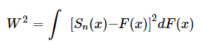

This integral essentially quantifies how well the EDF (based on your sample data) matches the theoretical CDF. A smaller value W2 of indicates a closer fit between the sample and the theoretical distribution. 

{:style="counter-reset:none"}
1. You can use the computed W2 statistic to perform a hypothesis test. The null hypothesis 
H0 typically assumes that the data follows the theoretical distribution, so a significant deviation in W2 from expected values under H0 suggests that the data does not fit the assumed distribution. 

The Cramér-von Mises test can be applied to evaluate whether a model's predictions conform to a specific distribution, which is a useful diagnostic tool for understanding the model's behavior. 

For this statistical test, Scipy also have a specific [method](https://docs.scipy.org/doc/scipy/reference/generated/scipy.stats.cramervonmises.html) available for use.

## G-Test 
The G-test, also known as the G-statistic or G-squared statistic, is a statistical test used in machine learning and statistics to assess the association or independence between categorical variables in contingency tables. It is commonly used for hypothesis testing when you have categorical data and want to determine if there is a significant relationship between two or more categorical variables. 

In the case of larger contingency tables (r x c), where r and c represent the number of rows and columns, respectively, the formula for the G-test statistic is: 

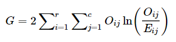

Where Oij is the observed frequency in cell (i, j) of the contingency table, Eij is the expected frequency in cell (i, j) assuming independence between the variables, and the double summation is over all cells in the contingency table. 

The G-test statistic measures how the observed frequencies Oij differ from the expected frequencies Eij under the assumption of independence between the categorical variables. A larger G-test statistic indicates a larger discrepancy between observed and expected frequencies, suggesting a stronger association between the variables. 

To assess the significance of the G-test statistic, you typically compare it to the chi-squared distribution with degrees of freedom determined by the dimensions of the contingency table. The associated p-value can be calculated to determine whether the observed association is statistically significant, allowing you to make conclusions about the independence or association of the categorical variables. 

For this statistical test, Scipy also have a specific [method](https://docs.scipy.org/doc/scipy/reference/generated/scipy.stats.chi2_contingency.html) available for use.

## Hellinger 
The Hellinger distance or Hellinger test is a statistical measure used to quantify the similarity or distance between probability distributions. It is often applied in machine learning and statistics to assess the similarity or dissimilarity between two probability distributions, such as comparing the distribution of observed data to an expected or reference distribution. 

The Hellinger distance is particularly useful when working with probability distributions, such as probability density functions (PDFs) or discrete probability mass functions (PMFs). It is defined based on the Hellinger divergence, which measures the divergence between two probability distributions. 

Here's the formula for the Hellinger distance between two probability distributions P and Q: 

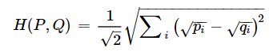

Where H(P,Q) is the Hellinger distance between distributions P and Q, and pi and qi are the probabilities associated with each possible outcome i. 

The Hellinger distance ranges from 0 (indicating identical distributions) to 1 (indicating completely dissimilar distributions); smaller values suggest greater similarity. When using the Hellinger distance in machine learning, you would typically compare it to a threshold or use it as part of a larger evaluation or decision-making process, depending on the specific task or application. 

Once you have two probability distributions as input, you can utilize the [hellinger](https://tedboy.github.io/nlps/generated/generated/gensim.matutils.hellinger.html) method from the gensim package.

## Mann-Whitney U-Rank Test 
The Mann-Whitney U test, also known as the Mann-Whitney-Wilcoxon test, Wilcoxon rank-sum test, or Wilcoxon-Mann-Whitney test, is a non-parametric statistical test used to determine whether two independent groups come from the same population or have significantly different distributions. It is a valuable tool in machine learning for comparing two groups or samples when the assumptions of normality or equal variances, required for parametric tests like the t-test, are not met. 

To conduct the Mann-Whitney U Test, we first pool the data from both groups into one dataset. Then, we rank all data from smallest to largest, with ties receiving the average of the ranks they would’ve received if un-tied. Then, we utilize the following formula to calculate the U statistic for each group: 

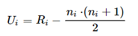

Where R_i is the sum of ranks for group i, and n_i is the sample size of group i. If U is small, it suggests that observation in one group tends to have lower ranks than in the other group. We also compare the calculated U statistics to critical values from the U distribution or use a significance level. We reject the null hypothesis of having no difference between two groups if there is a significant difference. Note that this only assesses the difference in distribution shape and central tendency but does not provide info about the difference’s size. 

For this statistical test, Scipy also have a specific [method](https://docs.scipy.org/doc/scipy/reference/generated/scipy.stats.mannwhitneyu.html) available for use.

## Energy Distance 
Energy distance is a statistical measure used to quantify the dissimilarity or discrepancy between two probability distributions. It is a metric that assesses how different two datasets or distributions are from each other in a non-parametric and distribution-free manner. Energy distance is often used in machine learning and statistics for various purposes, including data analysis and model comparison. 

The energy distance between two datasets or distributions, X and Y, is defined as follows: 

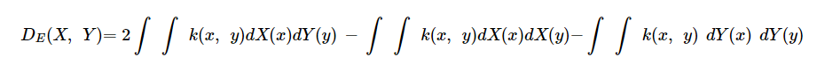

Where DE(X, Y) is the energy distance between datasets X and Y and k(x, y) is a positive definite kernel function. Common choices include the Gaussian kernel 

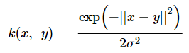

and the Laplacian kernel 

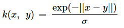

Where ∫∫ represents the integral over the entire space of possible values. 

For this statistical test, Scipy also have a specific [method](https://docs.scipy.org/doc/scipy/reference/generated/scipy.stats.energy_distance.html) available for use.

## Epps-Singleton Test 
The Epps-Singleton test is a statistical test used to determine whether two samples come from the same probability distribution. It is particularly useful when comparing two independent samples to assess their similarity or dissimilarity in a non-parametric and distribution-free manner. The test was developed as an alternative to the classical two-sample tests, such as the t-test or Wilcoxon-Mann-Whitney U test, which rely on specific distributional assumptions. 

The steps to conduct the Epps-Singleton Test are very similar to the U test. The formula is as follows: 

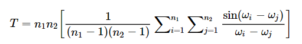

Where n_1 and n_2 are the sample sizes of the two groups, and w_i and w_j are the ordered values from the two samples. Essentially, we are computing the log-likelihood ratio between the two samples; the distribution approaches the chi-squared distribution as the sample size increases. 

For this statistical test, Scipy also have a specific [method](https://docs.scipy.org/doc/scipy/reference/generated/scipy.stats.epps_singleton_2samp.html) available for use.

## T-Test 
The t-test is a statistical hypothesis test used to determine whether there is a significant difference between the means of two groups or samples. It is a widely used parametric test in statistics and can be applied in various ways within the field of machine learning. The t-test is particularly valuable when comparing the means of two groups to assess whether they are statistically distinguishable. 

There are several types of t-tests, but the most commonly used ones are: 
1. **Independent Samples T-Test**: Used to compare the means of two independent groups to determine if they come from populations with different means. The X-bars are sample means of groups 1 and 2, s1 and s2 are sample standard deviations of groups 1 and 2, and n1 and n2 are sample sizes of groups 1 and 2. 

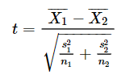

A positive t-value implies that the first group mean is larger, while a negative t-value suggests otherwise. Generally, the larger the absolute value of a t-statistic, the more evidence we usually have against the null hypothesis. 

{:style="counter-reset:none"}
1. **Paired Samples T-Test**: Used to compare the means of paired or dependent observations, such as before-and-after measurements within the same group. The d-bar is the mean of differences between the paired distributions, s_d is the standard deviation of the differences, while n is the number of paired observations. 

A positive t-value suggests that the mean of the first sample is larger, while a negative t-value suggests otherwise. 

{:style="counter-reset:none"}
1. One-Sample T-Test: Used to compare the mean of a single sample to a known or hypothesized population mean. The x-bar is the sample mean, mu_0 is the hypothesized population mean, s is the sample standard notation, and n is the sample size. 

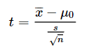

A positive t-value means that the sample mean is larger than the hypothesized population mean.  

For this statistical test, Scipy also have a specific [method](https://docs.scipy.org/doc/scipy/reference/generated/scipy.stats.ttest_ind.html) available for use.

## Empirical Maximum Mean Discrepancy 
Empirical Maximum Mean Discrepancy (MMD) is a statistical measure used to quantify the dissimilarity or discrepancy between two sets of data points or probability distributions. It is a non-parametric metric that assesses how different two datasets or distributions are from each other in a data-driven manner. MMD is particularly valuable in machine learning for comparing and contrasting different datasets, domains, or probability distributions. 

MMD is defined based on the Maximum Mean Discrepancy metric, which measures the difference between the expected values of a given function applied to samples from two distributions. The Empirical MMD is defined as: 

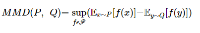

Where P and Q are the two distributions or datasets being compared, F is a set of functions (typically a reproducing kernel Hilbert space),  f is a function in the set F, 𝔼x∼P[f(x)] represents the expected value of f(x) when x follows distribution P, and 𝔼y∼Q[f(y)] represents the expected value of f(y) when y follows distribution Q. 

## Total-Variation-Distance 
Total Variation Distance (TVD), also known as the total variation norm or L1 distance, is a statistical measure used to quantify the dissimilarity or discrepancy between two probability distributions. It is a distance metric that provides a simple and intuitive way to measure how different two probability distributions are from each other. In machine learning, TVD is used for various purposes, including model evaluation, probability distribution comparison, and generative model assessment. 

The Total Variation Distance between two probability distributions P and Q is defined as: 

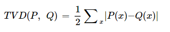

Where P(x) and Q(x) are the probability mass (in the case of discrete distributions) or probability density (in the case of continuous distributions) at point x. The summation is taken over all possible values of x for discrete distributions or integrated over the entire support for continuous distributions. 

TVD scores range from 0 to 1, with 0 indicating that the two distributions are identical and 1 indicating that they are completely dissimilar. Smaller TVD values suggest greater similarity between distributions, while larger values suggest greater dissimilarity. All in all, TVD provides a straightforward and intuitive measure of dissimilarity that does not assume specific distributional forms for the data. 

For this statistical test, Forest-Benchmarking package offers a [method](https://forest-benchmarking.readthedocs.io/en/latest/autogen/forest.benchmarking.distance_measures.total_variation_distance.html) for the extraction of values.